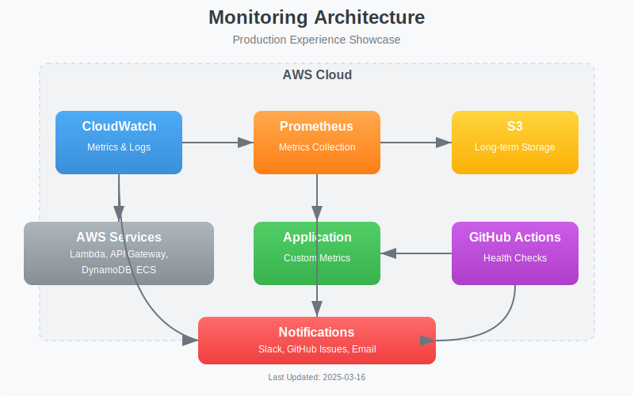

# Documentation Assets

## Overview

This directory contains assets used in project documentation, such as diagrams, screenshots, and other visual elements. Organizing these assets centrally helps maintain consistency and makes them easier to update.

## Directory Structure

- `images/` - Contains image files (primarily SVG) for diagrams and visualizations
  - `architecture/` - Legacy architecture diagrams and references
  - `workflows/` - Process and workflow diagrams
  - `ui/` - User interface mockups and screenshots

## Asset Guidelines

### File Naming

- Use kebab-case for all filenames (e.g., `network-diagram.svg`)
- Include a descriptor of the content type (e.g., `monitoring-architecture.svg`)
- For versioned assets, include the version number (e.g., `system-architecture-v2.svg`)

### Image Formats

- Use **SVG** for all diagrams (better for scaling, updates, and GitHub rendering)
- Use **PNG** only when SVG is not possible (screenshots, etc.)
- Avoid JPG format as it doesn't support transparency and degrades quality

### Resolution and Size

- SVGs are preferred as they scale without quality loss
- Optimize all images for web display (compress when possible)
- Diagrams should be readable at standard viewing sizes

## Source Files

For diagrams created with tools like Draw.io, Lucidchart, or Figma, consider storing the source files in a separate version control repository or design system. This keeps the main repository lightweight while allowing for easier updates in the future.

## Usage in Documentation

When referencing assets in Markdown documentation, use relative paths and prefer SVG format:

```markdown


_Figure 1: Production Experience monitoring architecture_
```

---

**Last Updated**: 2025-03-16
**Version**: 1.1
