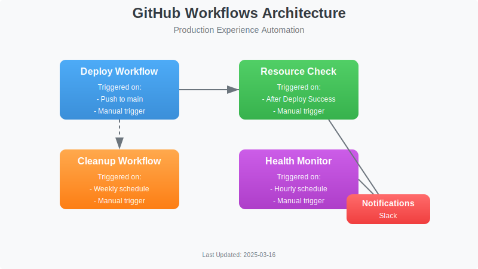

# CI/CD Process

**Version:** 1.1
**Last Updated:** March 16, 2025
**Owner:** DevOps Team

## Overview

This document outlines the Continuous Integration and Continuous Deployment (CI/CD) process for the Production Experience Showcase. The CI/CD pipeline automates the build, test, and deployment processes to ensure consistent and reliable software delivery.

## CI/CD Pipeline

The CI/CD pipeline is implemented using GitHub Actions and consists of the following stages:

1. **Code Validation**

   - Linting
   - Unit Testing
   - Integration Testing
   - Security Scanning

2. **Build**

   - Compile code
   - Create artifacts
   - Build Docker images

3. **Deployment**

   - Deploy to AWS using CDK
   - Configure infrastructure
   - Update services

4. **Post-Deployment**
   - Resource verification
   - Health checks
   - Smoke tests

## Related Workflows

<!-- TODO: Verify workflow YAML filenames (resource-check.yml, health-monitor.yml, cleanup.yml) -->

Our CI/CD process is supported by several GitHub Actions workflows:

### Main Workflows

- **Deploy Workflow** (`deploy.yml`): Handles the main deployment process
- **Resource Check Workflow** (`resource-check.yml`): Verifies AWS resources after deployment
- **Health Monitoring Workflow** (`health-monitor.yml`): Regularly checks service health
- **Cleanup Workflow** (`cleanup.yml`): Manages unused AWS resources

For detailed information about these workflows, see the [GitHub Workflows](github-workflows.md) documentation.

## Deployment Process

### Prerequisites

- AWS credentials configured as GitHub secrets
- Required permissions for CDK deployment
- Passing tests and security scans

### Deployment Steps

1. **Trigger Deployment**

   - Automatically on push to main branch
   - Manually via workflow dispatch

2. **Pre-Deployment Checks**

   - Run linting and tests
   - Verify dependencies
   - Check security vulnerabilities

3. **CDK Deployment**

   - Synthesize CloudFormation templates
   - Deploy infrastructure changes
   - Update application code

4. **Post-Deployment Verification**
   - Run resource check workflow
   - Verify service health
   - Run smoke tests

## Rollback Process

In case of deployment failures:

1. **Automatic Rollback**

   - CDK automatically rolls back failed deployments
   - Failed health checks trigger alerts

2. **Manual Rollback**
   - Redeploy previous version
   - Run verification checks

## Monitoring and Alerting

- **Health Monitoring**: Hourly checks of all services
- **Resource Verification**: After each deployment
- **Alerting Channels**: GitHub Issues and Slack notifications

## Related Documentation

- [GitHub Workflows](github-workflows.md)
- [AWS Resource Management Overview](resource-management-overview.md)
- [Monitoring Setup](../monitoring/monitoring.md)

---

**Last Updated**: [Current Date - will be filled by system]
**Version**: 1.2
