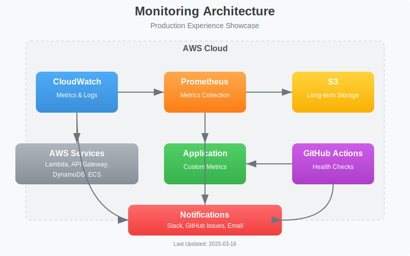

# Monitoring Setup

**Version:** 1.0
**Last Updated:** March 16, 2025
**Owner:** DevOps Team

## Overview

This document outlines the monitoring infrastructure and practices implemented in the Production Experience Showcase. The monitoring system provides visibility into application performance, resource utilization, and system health.

## Monitoring Architecture

The monitoring architecture consists of the following components:

1. **Prometheus**: For metrics collection and storage
2. **CloudWatch**: For AWS service metrics and logs
3. **Health Monitoring Workflow**: For regular service health checks
4. **Alerting System**: For notifications via Slack and GitHub Issues

## Prometheus Setup

Prometheus is deployed as a containerized service and configured to scrape metrics from:

- Application endpoints
- AWS services (via CloudWatch exporter)
- Infrastructure components

### Key Metrics

| Metric Category | Examples                           | Purpose              |
| --------------- | ---------------------------------- | -------------------- |
| Application     | Request count, latency, error rate | Service performance  |
| Infrastructure  | CPU, memory, disk usage            | Resource utilization |
| Business        | Transaction count, user activity   | Business health      |

### Retention and Storage

- Metrics are retained for 15 days in Prometheus
- Long-term storage is implemented via S3 for historical analysis

## CloudWatch Integration

CloudWatch is used to monitor AWS-specific resources and services:

- Lambda function metrics (invocations, errors, duration)
- API Gateway metrics (count, latency, errors)
- DynamoDB metrics (read/write capacity, throttling)
- VPC flow logs for network traffic analysis

## Health Checks

The Health Monitoring workflow (`health-monitor.yml`) performs regular checks:

- **Frequency**: Hourly
- **Scope**: All critical services and endpoints
- **Checks**:
  - API endpoint availability
  - Database connectivity
  - Authentication services
  - Background processing

### Health Check Process

1. The workflow runs on a scheduled basis
2. It tests all critical service endpoints
3. Results are recorded and analyzed
4. Issues trigger notifications and create GitHub issues

## Alerting Configuration

Alerts are configured for various conditions:

| Alert                | Condition           | Severity | Channel              |
| -------------------- | ------------------- | -------- | -------------------- |
| Service Down         | Health check fails  | Critical | Slack + GitHub Issue |
| High Error Rate      | Error rate > 5%     | Warning  | Slack                |
| Resource Utilization | CPU/Memory > 80%    | Warning  | Slack                |
| Latency Spike        | P95 latency > 500ms | Warning  | Slack                |

### Notification Channels

- **Slack**: For immediate team awareness
- **GitHub Issues**: For tracking and resolution
- **Email**: For daily/weekly summaries (optional)

## Dashboards

Monitoring dashboards are available for:

1. **Service Health**: Overall system status
2. **Performance**: Latency and throughput metrics
3. **Resource Utilization**: CPU, memory, and storage usage
4. **Business Metrics**: User activity and transactions

## Related Workflows

The following GitHub Actions workflows support monitoring:

- **Health Monitoring Workflow**: Performs regular health checks
- **Resource Check Workflow**: Verifies AWS resource configuration
- **Cleanup Workflow**: Manages monitoring resources (log groups, etc.)

For detailed information about these workflows, see the [GitHub Workflows](github-workflows.md) documentation.

## Related Documentation

- [CI/CD Process](ci-cd.md)
- [GitHub Workflows](github-workflows.md)
- [AWS Resource Management](aws-resource-management.md)
